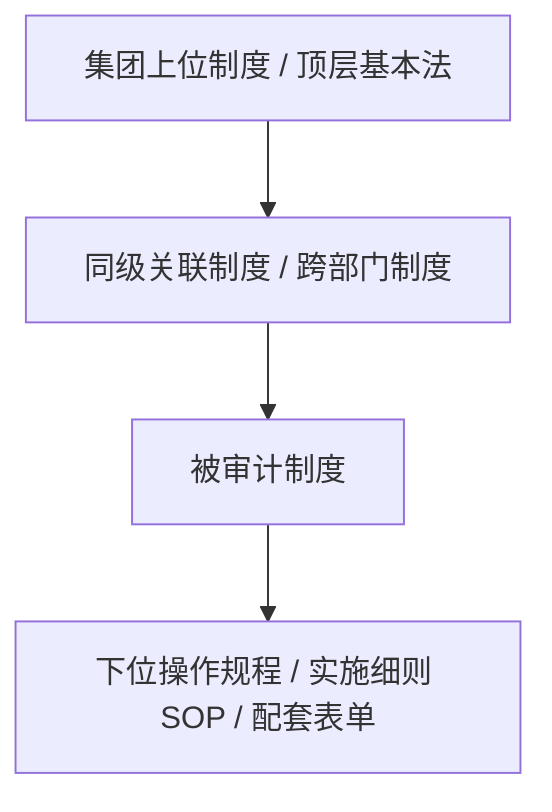

# 📋 企业制度与流程审计 Skill (policy-auditor)

本 Skill 用于对企业起草或修订的**管理制度、业务流程、管理办法、操作规程、问责条例、奖惩机制**等文本进行体系化审计。通过融合 7 大核心能力、10 大审核维度、风险评分模型、成熟度模型、制度关系图谱、数字化落地检查器及核心内控矩阵，识别管理漏洞，输出强执行力的整改方案。

---

## 📊 一、 制度审计量化评估模型

在执行审计时，Agent 必须输出以下三大评估工具：

### 1. 风险评分模型 (Risk Scoring Model)
对审计发现的每个漏洞/缺陷，按以下标准进行定性与定量评估：

* **风险等级 (Risk Level)**:
  * **P0 (违法违规 - 对应评分 3)**：违反国家法律法规、行业强制性监管要求，存在行政处罚、劳动仲裁或刑事法律诉讼风险。
  * **P1 (高风险 - 对应评分 2)**：存在严重内控漏洞，易导致重大财务损失、资金失控、贪腐舞弊或核心品牌声誉严重受损。
  * **P2 (中风险 - 对应评分 1)**：流程不闭环、部门间推诿扯皮、时效（SLA）缺失，导致运营效率低下或轻微资产流失。
  * **P3 (低风险 - 对应评分 0)**：排版文字错误、条款序号缺失、表单编号不一致、表述含糊等文字或格式问题。
* **影响维度 (Impact)**：明确评估该风险属于 **【法律】**、**【财务】**、**【运营】** 还是 **【品牌】** 层面（可多选）。
* **发生概率 (Probability)**：根据条款的约束力和实操漏洞大小，评估该风险发生的可能性为 **【高】**、**【中】** 或 **【低】**。

### 2. 制度成熟度评估 (Policy Maturity Model)
参考 **COBIT** 和 **CMMI** 思想，对被审计制度的整体管理成熟度进行评级（L1 - L5）：

| 成熟度等级 | 等级说明 | 评估标准 |
| :--- | :--- | :--- |
| **L1 (经验管理)** | 依人治理 / 救火式 | 缺乏成文制度，或者制度中无明确流程与标准动作，全凭岗位人员经验摸索执行。 |
| **L2 (制度管理)** | 有文可依 / 粗放型 | 形成了成文制度，明确了基本要求和原则，但职责分工模糊，缺少关键控制点和闭环机制。 |
| **L3 (流程管理)** | 流程导向 / 闭环型 | 流程闭环（有事前/事中/事后控制），职责清晰（有RACI），有明确的时效（SLA）和配套表单，要素完整。 |
| **L4 (数字化管理)** | 系统约束 / 刚性型 | 制度控制点已全面沉淀至 SAP、OA、CRM 或多维表系统中，实现“系统锁死、不可跳过、自动流转与数据留痕”。 |
| **L5 (智能治理)** | 动态优化 / 智能型 | 拥有基于数据看板的动态监控机制（如大单品价格预测、自动异常分析），制度能够基于实际运行数据自动迭代与智能纠偏。 |

### 3. 制度图谱建模 (Policy Graph Modeling)
任何企业制度都不是孤立存在的。审计时，Agent 必须对被审计制度进行**依赖关系建模**，并用 **Mermaid 流程图** 画出制度图谱，明确其在企业制度树中的位置：


* **上游依赖 (Parent)**：受制于哪些集团级管理大纲或国家法律法规。
* **同级协同 (Peer)**：与哪些关联制度（如《招标管理制度》、《合同评审制度》、《付款管理制度》）存在数据交换或权限交织。
* **下游分支 (Child)**：下辖哪些具体的岗位操作规程（SOP）和表单档案。

---

## 🔍 二、 核心内控与数字化落地检查器

### 1. 集团企业核心内控检查点 (Internal Controls)
审计制度时，必须强制扫描是否落实了以下 7 大内控红线：
* **职责分离 (SoD)**：关键环节是否实现“不相容职责分离”（如：付款申请人与审批人分离、合同起草人与法律审核人分离、现场验收人与结算造价审核人分离）。
* **授权矩阵 (LOA)**：是否有清晰的授权决策矩阵，确保各级岗位的审批权限有明确的额度边界。
* **审批权限**：审批链条是否合理，是否存在“一言堂”（审批权限集中在单人）或“虚化审批”（层层签字但无人能核实真实业务，导致流于形式）。
* **资金控制**：大额资金出账是否有前置对账、双人会签及预算硬预算超限拦截。
* **印章管理**：变更、签章、印章（公章/合同章/法人章）使用是否有刚性的物理及系统卡点，严禁个人签字直接作为结算依据。
* **合同管理**：是否规定了合同范本强控、不准擅自修改核心免责条款，以及合同外补充协议的严格审批程序。
* **库存管理**：对于涉及物料、设备、库存交割的环节，是否有独立的第三方盘点、过磅监装和账实核对规定。

### 2. 数字化落地检查器 (Digital Landing Checker)
严禁给出“建议加强系统管理”等空洞描述，必须对照以下检查器，给出具体的系统配置建议：
* **系统硬校验 (System Validation)**：在 SAP/OA 等系统中设置必填字段或逻辑校验（例如：SAP 检验合同外签证金额累计超 5% 时，系统强制锁定付款流程）。
* **表单刚性锁定 (Form Lock)**：前置流程输出物（如验收单、评审会纪要、见证照片）必须作为下个节点的必传附件，否则系统无法流转。
* **自动流控路由 (Auto Routing)**：系统依据金额大小自动分发审批路径，防止人为选择审批分支规避监管。
* **多维数据看板 (Dashboard Monitoring)**：利用飞书多维表等工具将所有过程数据（如签证时效、流标率）自动化留痕，生成合规风险预警看板。

---

## 🛠️ 审计工作流 (Workflow)

1. **结构拆解**：解析文本，梳理出制度的“目的、范围、职责、流程、表单、考核、审批权限”等关键要素。
2. **制度图谱建模**：绘制 Mermaid 流程图展示被审计制度与上下游制度的依赖关系。
3. **十大维度与内控扫描**：对照 10 大维度与 7 大内控卡点，对具体条款进行深度审计。
4. **风险量化与评级**：为每个识别出的漏洞评估 **Risk Level (P0-P3)**、**Impact** 与 **Probability**。
5. **成熟度定位**：评估该制度的当前成熟度（L1-L5），并说明理由。
6. **输出整改建议**：针对每个风险点，通过【数字化落地检查器】提供针对性的系统落地建议，并输出 Markdown `diff` 修订对比。

---

## 📄 审计报告输出模板 (Report Template)

```markdown
# 📌 [公司/部门名称]·[制度/流程名称] 审计与合规评估报告

**评估人**：[Agent 名称] (使用 policy-auditor 技能)  
**评估日期**：2026年XX月XX日  
**评估结论**：[合格 / 需重大修订后重新评估 / 需局部修改后发布]

---

## 一、 制度依赖图谱 (Policy Dependency Graph)
[使用 Mermaid 绘制被审计制度在企业制度树中的上下游关系]

## 二、 完整性要素评估与成熟度定位
### 1. 完整性要素评估 (Completeness)
* **目的**：[有/无] - [描述]
* **范围**：[有/无] - [描述]
* **职责**：[有/无] - [描述]
* **流程**：[有/无] - [描述]
* **表单**：[有/无] - [描述]
* **考核**：[有/无] - [描述]
* **审批权限**：[有/无] - [描述]

### 2. 制度成熟度评估 (Maturity)
* **当前等级**：**[L1 - L5] ([等级名称])**
* **评估理由**：[详细描述该等级的支撑事实，如：流程缺乏数字化刚性锁定，仍停留在L2到L3阶段]

---

## 三、 核心内控与条款缺陷分析 (Control & Clause Analysis)
[逐条分析存在的缺陷漏洞。每项必须标注风险评分模型参数]

### 1. [缺陷简述]
* **涉及条款**：[具体章节与条文]
* **内控缺陷类型**：[职责分离 / 授权矩阵 / 审批权限 / 资金控制 / 印章管理 / 合同管理 / 库存管理]
* **条款漏洞剖析**：[详细剖析]
* **风险量化提示**：
  * **风险等级**：`P0` / `P1` / `P2` / `P3` (评分: 3 / 2 / 1 / 0)
  * **影响维度**：[法律 / 财务 / 运营 / 品牌]
  * **发生概率**：[高 / 中 / 低]
  * **潜在损失**：[描述可能引发的诉讼、舞弊、效率低下或财务损失]

---

## 四、 针对性整改优化建议（Action Items）
[结合数字化落地检查器提供整改方案，并提供 diff 条款]

### 1. [整改项名称]
* **整改要点**：[如何对齐法律、如何确保职责分离等]
* **数字化落地建议 (Digital Controls)**：[针对 SAP/OA/多维表提出前置校验、自动路由或附件刚性锁定的具体配置建议]
* **条款修改对比**：
```diff
- [修改前的原始条款]
+ [修改后的合规且可执行条款]
```
```
