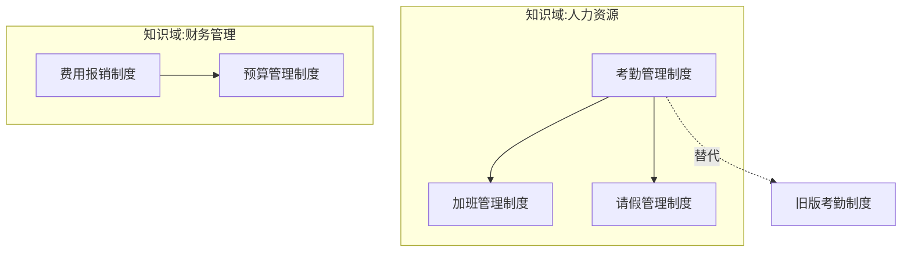

# 📋 企业制度与流程审计 Skill v2 (policy-auditor-v2)

本 Skill 用于对企业起草或修订的**管理制度、业务流程、管理办法、操作规程、问责条例、奖惩机制**等文本进行体系化审计。

## 一、数据接入层

### 1.1 Excel数据源

**主数据文件：** `天邦食品394个制度梳理汇总表-20260601xlsx.xlsx`

**工作表结构：**
- 工作表1「制度梳理汇总表」：394条制度，20个字段
- 工作表2「编码规则」：115行编码规则（类别/前缀/模块名称/模块代码）

**字段映射表：**

| 列号 | 字段名 | 审计用途 |
|------|--------|----------|
| 0 | 序号 | 唯一标识 |
| 1 | 原文件名称 | 审计报告标题 |
| 2 | 制度编号 | 关联查询、编码校验 |
| 3 | 制度层级 | 成熟度评估参考 |
| 4 | 知识域 | 制度图谱建图 |
| 5 | 类别 | 制度图谱建图、内控规则匹配 |
| 6 | 发文部门 | 权责分析 |
| 7 | 适用范围/单位 | 审计范围界定 |
| 8 | 适用场景 | 可执行性评估 |
| 9 | 密级 | 输出权限控制 |
| 10 | 生效日期 | 时效性检查 |
| 11 | 版本号 | 修订追踪 |
| 12 | 废止/修订说明 | 一致性检查 |
| 13 | 前置制度是否冲突 | **关键输入**：一致性检查 |
| 14 | 替代的制度名称 | 制度图谱建图 |
| 15 | 关键词 | 快速定位、关联分析 |
| 16 | 摘要 | 审计上下文补充 |
| 17 | 附件 | 完整性检查 |
| 18 | 安全性审核 | 合规性检查 |
| 19 | 提交人 | 责任追溯 |

### 1.2 数据加载脚本

使用 `scripts/data_loader.py` 加载Excel数据：

```bash
python scripts/data_loader.py --excel "天邦食品394个制度梳理汇总表-20260601xlsx.xlsx" --output policies.json
```

**输出格式：**
```json
{
  "total": 394,
  "policies": [
    {
      "index": 1,
      "original_name": "制度-人力资源-考勤...",
      "policy_id": null,
      "hierarchy": "三级制度",
      "knowledge_domain": "制度",
      "category": "人力资源",
      "department": "汉世伟人力资源部",
      "scope": "汉世伟食品公司总部全体员工",
      "scenario": "员工入职...",
      "confidential": "普通",
      "effective_date": "20200901",
      "version": "/",
      "obsolete_note": "/",
      "has_conflict": "否",
      "replaces": null,
      "keywords": "入职手续...清单",
      "summary": "本文档为...",
      "attachments": "...",
      "security_check": "通过",
      "submitter": "张三"
    }
  ],
  "encoding_rules": [...]
}
```

### 1.3 编码规则集成

编码规则用于：
1. 校验制度编号是否符合规范
2. 根据编号推断制度所属模块
3. 编号缺失时自动生成建议编号

**编码格式：** `[类别前缀]-[模块代码]-[序号]`

示例：`HR-10-001` 表示 人力资源-考勤管理-第001号

---

## 二、审计引擎

### 2.1 单条审计流程

```
输入：制度文本（PDF/Word/原始文件）
      + 结构化数据（从Excel读取的20字段）
         │
         ▼
┌─────────────────────────────────────┐
│ Step 1: 数据预加载                    │
│ · 读取Excel中的该条制度的20字段       │
│ · 检查"前置制度是否冲突"字段          │
│ · 检查"替代的制度名称"字段            │
│ · 加载同类制度（同知识域+类别）        │
└─────────────────┬───────────────────┘
                  ▼
┌─────────────────────────────────────┐
│ Step 2: 结构拆解                      │
│ · 解析文本结构（目的/范围/职责/流程）  │
│ · 对比Excel中的摘要字段               │
│ · 识别缺失要素                        │
└─────────────────┬───────────────────┘
                  ▼
┌─────────────────────────────────────┐
│ Step 3: 十大维度审计                  │
│ · 合法性、合规性、完整性...           │
│ · 内控红线扫描（7项）                 │
│ · 利用已有字段辅助判断                │
└─────────────────┬───────────────────┘
                  ▼
┌─────────────────────────────────────┐
│ Step 4: 风险量化                      │
│ · P0-P3风险等级                       │
│ · 影响维度（法律/财务/运营/品牌）      │
│ · 发生概率（高/中/低）                │
└─────────────────┬───────────────────┘
                  ▼
┌─────────────────────────────────────┐
│ Step 5: 成熟度评估                    │
│ · L1-L5等级判定                       │
│ · 参考制度层级字段                    │
└─────────────────┬───────────────────┘
                  ▼
┌─────────────────────────────────────┐
│ Step 6: 输出生成                      │
│ · 审计报告（Markdown）                │
│ · 结构化JSON（供系统消费）            │
│ · 制度图谱（Mermaid，自动生成）       │
└─────────────────────────────────────┘
```

### 2.2 批量审计流程（一次性初始化）

```bash
# 1. 加载数据
python scripts/data_loader.py --excel "天邦食品394个制度梳理汇总表-20260601xlsx.xlsx" --output policies.json

# 2. 批量审计（Agent执行）
# 对每条制度执行单条审计流程，输出JSON到 audit_results/ 目录

# 3. 汇总生成
python scripts/batch_audit.py --input-dir audit_results/ --out-dir audit_output/
```

---

## 三、制度图谱自动生成

### 3.1 建图规则

基于已有字段自动建立关系：

| 关系类型 | 数据来源 | 生成方式 |
|----------|----------|----------|
| 同域关系 | 知识域相同 | 自动聚合 |
| 同类关系 | 类别相同 | 自动聚合 |
| 替代关系 | 替代的制度名称 | 文本匹配 |
| 冲突关系 | 前置制度是否冲突 | 直接读取 |
| 层级关系 | 制度层级 | 自动分层 |
| 部门关系 | 发文部门 | 自动聚合 |

### 3.2 使用方式

```bash
python scripts/graph_generator.py --input policies.json --output policy_graph.mmd
```

**输出示例（Mermaid）：**


---

## 四、审计维度与评估模型

### 4.1 风险评分模型 (Risk Scoring Model)

对审计发现的每个漏洞/缺陷，按以下标准进行定性与定量评估：

* **风险等级 (Risk Level)**:
  * **P0 (违法违规 - 对应评分 3)**：违反国家法律法规、行业强制性监管要求，存在行政处罚、劳动仲裁或刑事法律诉讼风险。
  * **P1 (高风险 - 对应评分 2)**：存在严重内控漏洞，易导致重大财务损失、资金失控、贪腐舞弊或核心品牌声誉严重受损。
  * **P2 (中风险 - 对应评分 1)**：流程不闭环、部门间推诿扯皮、时效（SLA）缺失，导致运营效率低下或轻微资产流失。
  * **P3 (低风险 - 对应评分 0)**：排版文字错误、条款序号缺失、表单编号不一致、表述含糊等文字或格式问题。

* **影响维度 (Impact)**：明确评估该风险属于 **【法律】**、**【财务】**、**【运营】** 还是 **【品牌】** 层面（可多选）。

* **发生概率 (Probability)**：根据条款的约束力和实操漏洞大小，评估该风险发生的可能性为 **【高】**、**【中】** 或 **【低】**。

### 4.2 制度成熟度评估 (Policy Maturity Model)

参考 **COBIT** 和 **CMMI** 思想，对被审计制度的整体管理成熟度进行评级（L1 - L5）：

| 成熟度等级 | 等级说明 | 评估标准 |
| :--- | :--- | :--- |
| **L1 (经验管理)** | 依人治理 / 救火式 | 缺乏成文制度，或者制度中无明确流程与标准动作，全凭岗位人员经验摸索执行。 |
| **L2 (制度管理)** | 有文可依 / 粗放型 | 形成了成文制度，明确了基本要求和原则，但职责分工模糊，缺少关键控制点和闭环机制。 |
| **L3 (流程管理)** | 流程导向 / 闭环型 | 流程闭环（有事前/事中/事后控制），职责清晰（有RACI），有明确的时效（SLA）和配套表单，要素完整。 |
| **L4 (数字化管理)** | 系统约束 / 刚性型 | 制度控制点已全面沉淀至 SAP、OA、CRM 或多维表系统中，实现"系统锁死、不可跳过、自动流转与数据留痕"。 |
| **L5 (智能治理)** | 动态优化 / 智能型 | 拥有基于数据看板的动态监控机制（如大单品价格预测、自动异常分析），制度能够基于实际运行数据自动迭代与智能纠偏。 |

### 4.3 十大审计维度

| 维度 | 检查要点 |
|------|----------|
| 合法性 | 是否违反国家法律法规 |
| 合规性 | 是否符合行业监管要求 |
| 完整性 | 目的/范围/职责/流程/表单/考核是否齐全 |
| 一致性 | 与上位制度、同级制度是否冲突 |
| 可执行性 | 流程是否闭环、是否有SLA、是否有配套表单 |
| 风险性 | 是否存在内控漏洞 |
| 权责清晰 | 职责分工是否明确、是否有RACI |
| 审批合理 | 审批链条是否合理、是否有"一言堂" |
| 数据合规 | 涉及个人信息的是否有保护措施 |
| AI合规 | 是否需要AI合规审查 |

---

## 五、核心内控检查器

审计制度时，必须强制扫描是否落实了以下 7 大内控红线：

* **职责分离 (SoD)**：关键环节是否实现"不相容职责分离"（如：付款申请人与审批人分离、合同起草人与法律审核人分离、现场验收人与结算造价审核人分离）。

* **授权矩阵 (LOA)**：是否有清晰的授权决策矩阵，确保各级岗位的审批权限有明确的额度边界。

* **审批权限**：审批链条是否合理，是否存在"一言堂"（审批权限集中在单人）或"虚化审批"（层层签字但无人能核实真实业务，导致流于形式）。

* **资金控制**：大额资金出账是否有前置对账、双人会签及预算硬预算超限拦截。

* **印章管理**：变更、签章、印章（公章/合同章/法人章）使用是否有刚性的物理及系统卡点，严禁个人签字直接作为结算依据。

* **合同管理**：是否规定了合同范本强控、不准擅自修改核心免责条款，以及合同外补充协议的严格审批程序。

* **库存管理**：对于涉及物料、设备、库存交割的环节，是否有独立的第三方盘点、过磅监装和账实核对规定。

---

## 六、数字化落地检查器

严禁给出"建议加强系统管理"等空洞描述，必须对照以下检查器，给出具体的系统配置建议：

* **系统硬校验 (System Validation)**：在 SAP/OA 等系统中设置必填字段或逻辑校验（例如：SAP 检验合同外签证金额累计超 5% 时，系统强制锁定付款流程）。

* **表单刚性锁定 (Form Lock)**：前置流程输出物（如验收单、评审会纪要、见证照片）必须作为下个节点的必传附件，否则系统无法流转。

* **自动流控路由 (Auto Routing)**：系统依据金额大小自动分发审批路径，防止人为选择审批分支规避监管。

* **多维数据看板 (Dashboard Monitoring)**：利用飞书多维表等工具将所有过程数据（如签证时效、流标率）自动化留痕，生成合规风险预警看板。

---

## 七、输出规范

### 7.1 审计报告（Markdown）

```markdown
# 📌 [公司/部门名称]·[制度/流程名称] 审计与合规评估报告

**制度编号**：[从Excel读取]
**知识域**：[从Excel读取]
**类别**：[从Excel读取]
**评估人**：[Agent 名称] (使用 policy-auditor-v2 技能)  
**评估日期**：2026年XX月XX日  
**评估结论**：[合格 / 需重大修订后重新评估 / 需局部修改后发布]

---

## 一、 制度依赖图谱 (Policy Dependency Graph)
[使用 Mermaid 绘制被审计制度在企业制度树中的上下游关系]

## 二、 完整性要素评估与成熟度定位
### 1. 完整性要素评估 (Completeness)
* **目的**：[有/无] - [描述]
* **范围**：[有/无] - [描述]
* **职责**：[有/无] - [描述]
* **流程**：[有/无] - [描述]
* **表单**：[有/无] - [描述]
* **考核**：[有/无] - [描述]
* **审批权限**：[有/无] - [描述]

### 2. 制度成熟度评估 (Maturity)
* **当前等级**：**[L1 - L5] ([等级名称])**
* **评估理由**：[详细描述该等级的支撑事实]

---

## 三、 核心内控与条款缺陷分析 (Control & Clause Analysis)
[逐条分析存在的缺陷漏洞。每项必须标注风险评分模型参数]

### 1. [缺陷简述]
* **涉及条款**：[具体章节与条文]
* **内控缺陷类型**：[职责分离 / 授权矩阵 / 审批权限 / 资金控制 / 印章管理 / 合同管理 / 库存管理]
* **条款漏洞剖析**：[详细剖析]
* **风险量化提示**：
  * **风险等级**：`P0` / `P1` / `P2` / `P3` (评分: 3 / 2 / 1 / 0)
  * **影响维度**：[法律 / 财务 / 运营 / 品牌]
  * **发生概率**：[高 / 中 / 低]
  * **潜在损失**：[描述可能引发的诉讼、舞弊、效率低下或财务损失]

---

## 四、 针对性整改优化建议（Action Items）
[结合数字化落地检查器提供整改方案，并提供 diff 条款]

### 1. [整改项名称]
* **整改要点**：[如何对齐法律、如何确保职责分离等]
* **数字化落地建议 (Digital Controls)**：[针对 SAP/OA/多维表提出前置校验、自动路由或附件刚性锁定的具体配置建议]
* **条款修改对比**：
```diff
- [修改前的原始条款]
+ [修改后的合规且可执行条款]
```
```

### 7.2 结构化JSON（供系统消费）

**输出文件：** `audit_results/[policy_id].json`

**格式定义：** 参见 `audit_schema.json`

**核心字段：**
```json
{
  "policy_id": "HR-10-001",
  "policy_name": "考勤管理制度",
  "audit_date": "2026-06-08",
  "knowledge_domain": "人力资源",
  "category": "考勤管理",
  "department": "人力资源部",
  "maturity_level": "L2",
  "maturity_reason": "有成文制度但职责分工模糊",
  "risks": {
    "合法性": 0,
    "合规性": 1,
    "完整性": 2,
    "一致性": 1,
    "可执行性": 2,
    "风险性": 1,
    "权责清晰": 2,
    "审批合理": 1,
    "数据合规": 0,
    "AI合规": 0
  },
  "risk_items": [
    {
      "id": "R001",
      "level": "P2",
      "dimension": "完整性",
      "impact": ["运营"],
      "probability": "中",
      "clause": "第三章第5条",
      "description": "缺少SLA时效规定",
      "suggestion": "增加审批时限：普通请假3个工作日，特殊假期5个工作日"
    }
  ],
  "related_policies": ["HR-10-002", "HR-10-003"],
  "conflict_policies": ["HR-10-004"],
  "replaces_policies": ["HR-10-005"]
}
```

---

## 八、系统接口预留

### 8.1 知识库系统（Step 3）

**用途：**
- 问答时引用审计结论（"XX制度有什么风险？"）
- 审计结果作为制度推荐的权重因子
- 高风险制度优先推送整改

**接口格式：**
```
GET /api/policies/{policy_id}/audit
Response: 审计JSON结果
```

### 8.2 自动生成系统（Step 4）

**用途：**
- 生成新制度时自动校验
- 生成后自动审计，输出风险提示

**接口格式：**
```
POST /api/audit/check
Request: { "content": "制度文本", "category": "考勤管理" }
Response: { "risks": {...}, "suggestions": [...] }
```

---

## 九、使用示例

### 9.1 单条审计

```
用户：帮我审计一下考勤管理制度

Agent：
1. 读取Excel，找到该制度的20字段数据
2. 解析制度文本
3. 执行十大维度审计
4. 输出审计报告（MD）+ 结构化JSON
```

### 9.2 批量初始化

```
用户：帮我初始化审计394条历史制度

Agent：
1. 运行 data_loader.py 加载Excel数据
2. 逐条执行单条审计流程
3. 输出JSON到 audit_results/ 目录
4. 运行 batch_audit.py 生成风险地图和热力图
```

### 9.3 查询审计结果

```
用户：XX制度有什么风险？

Agent：
1. 读取 audit_results/[policy_id].json
2. 返回风险摘要
```

---

## 十、文件结构

```
policy-auditor-v2/
├── SKILL.md                    # 本文件
├── audit_schema.json           # JSON输出格式定义
├── requirements.txt            # Python依赖
└── scripts/
    ├── data_loader.py          # Excel数据加载脚本
    ├── graph_generator.py      # 制度图谱自动生成脚本
    └── batch_audit.py          # 批量审计汇总脚本
```

### 依赖说明

| 脚本 | 依赖库 | 用途 |
|------|--------|------|
| data_loader.py | pandas, openpyxl | 读取Excel文件 |
| graph_generator.py | 无外部依赖 | 纯Python实现 |
| batch_audit.py | pandas, matplotlib | 汇总统计 + 热力图生成 |

**安装依赖：**
```bash
pip install -r requirements.txt
```

---

## 十一、版本历史

| 版本 | 日期 | 变更说明 |
|------|------|----------|
| v1.0 | - | 原始版本，基于郭良志的policy-auditor |
| v2.0 | 2026-06-08 | 增加数据接入层、制度图谱自动生成、JSON输出规范、系统接口预留 |
